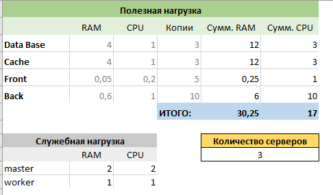
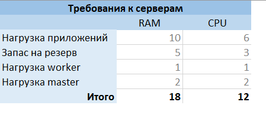

# Домашняя работа к занятию 12.3 «Развертывание кластера на собственных серверах, лекция 1»
Поработав с персональным кластером, можно заняться проектами. Вам пришла задача подготовить кластер под новый проект.

## Задание 1: Описать требования к кластеру
>Сначала проекту необходимо определить требуемые ресурсы. Известно, что проекту нужны база данных, система кеширования, а само приложение состоит из бекенда и фронтенда. Опишите, какие ресурсы нужны, если известно:
>
>- База данных должна быть отказоустойчивой. Потребляет 4 ГБ ОЗУ в работе, 1 ядро. 3 копии.
>- Кэш должен быть отказоустойчивый. Потребляет 4 ГБ ОЗУ в работе, 1 ядро. 3 копии.
>- Фронтенд обрабатывает внешние запросы быстро, отдавая статику. Потребляет не более 50 МБ ОЗУ на каждый экземпляр, 0.2 ядра. 5 копий.
>- Бекенд потребляет 600 МБ ОЗУ и по 1 ядру на копию. 10 копий.
>
> 

Как оформить ДЗ?

>
>Выполненное домашнее задание пришлите ссылкой на .md-файл в вашем репозитории.
>
>План расчета
>1. Сначала сделайте расчет всех необходимых ресурсов.
>2. Затем прикиньте количество рабочих нод, которые справятся с такой нагрузкой.
>3. Добавьте к полученным цифрам запас, который учитывает выход из строя как минимум одной ноды.
>4. Добавьте служебные ресурсы к нодам. Помните, что для разных типов нод требовния к ресурсам разные.
>5. Рассчитайте итоговые цифры.
>6. В результате должно быть указано количество нод и их параметры.

Я рассчитал минимальную конфигурацию, необходимую для построения отказоустойчивого кластера.
Для развёртывания кластера потребуется три сервера, на каждом из них разместится одна control-нода и одна worker-нода. Нагрузку посчитал для физических серверов:

- Вводные данные по нагрузке:

- Требования к серверам:

В итоге потребуется три сервера, на каждом должно быть 12 ядер CPU и 18 Gb RAM.